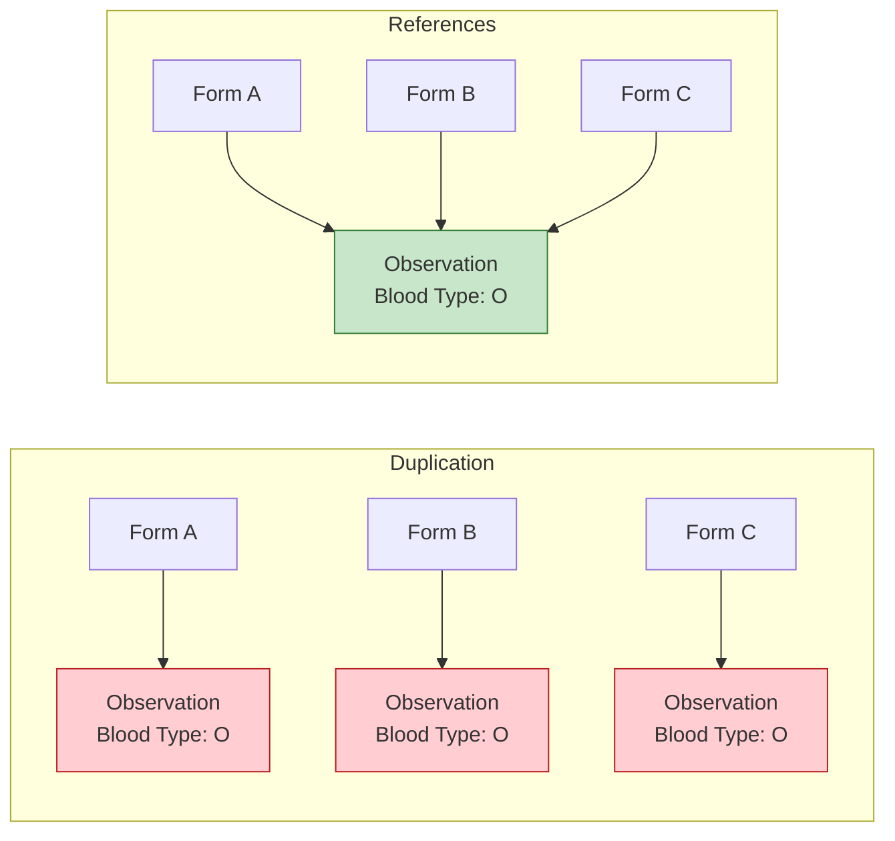
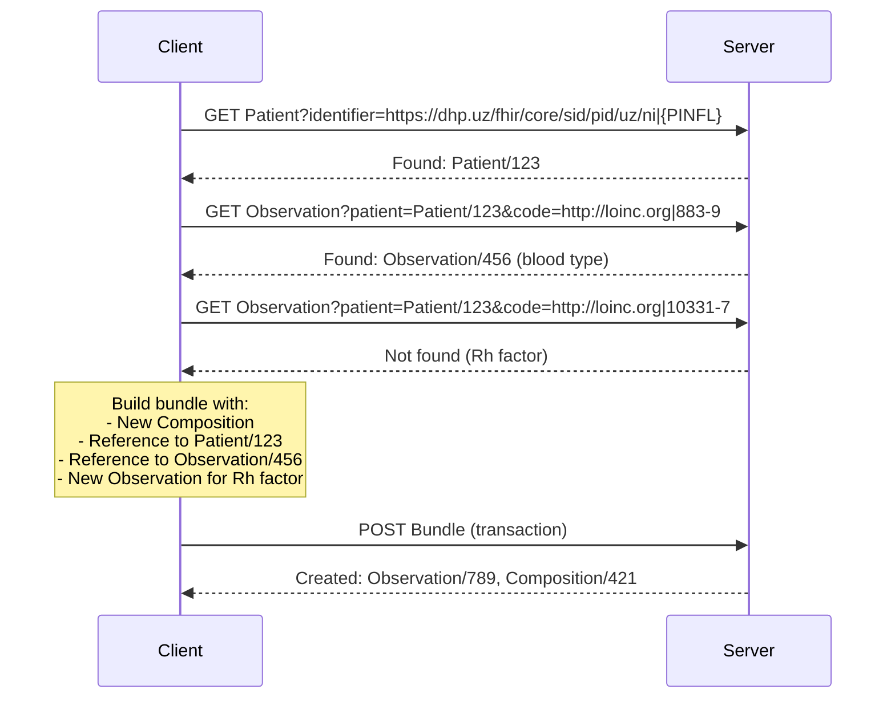
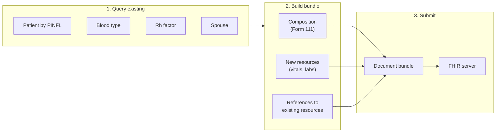

# Data deduplication in clinical documents

## Problem

Healthcare data is often captured redundantly across multiple interactions. Paper workflows copy information between forms. Digital systems may create duplicate records for the same clinical facts.

Consequences of duplication:
- Inconsistent data (which blood type is correct?)
- Storage waste
- Reconciliation burden
- Audit complexity

This duplicating can be especially prevalent in digital forms, journals, or blanks capture.

## Solution: atomic resources + references

FHIR resources are atomic - each resource represents a single clinical fact. Instead of duplicating data, systems should reference existing resources.



## Query-before-create pattern

Before creating a resource in a clinical document, query whether it already exists. Below is an example using a clinical document:



## When to de-duplicate?

Not all resources should be deduplicated. In clinical scenarios, information may need to be explicitly re-confirmed at a point in time, even if unchanged. For example, blood pressure - monitoring trends requires recording each measurement, not referencing the first one. However, if a blood pressure was just recorded (one clinical action), it can be referenced in multiple forms; if a practitioner takes a new measurement, a new resource should be created.

## Example: clinical forms

Clinical forms often reference the same data. A pregnancy card (Form 111) captures blood type once; subsequent visits reference it.

### Workflow



### Document bundle structure

A document bundle can contain:
- References only - to existing server resources
- New resources - to be created (use `urn:uuid:`)

```json
{
  "resourceType": "Bundle",
  "type": "document",
  "entry": [
    {
      "fullUrl": "urn:uuid:composition-1",
      "resource": {
        "resourceType": "Composition",
        "status": "final",
        "type": {"coding": [{"code": "form-111"}]},
        "subject": {"reference": "Patient/123"},
        "section": [
          {
            "title": "Laboratory",
            "entry": [
              {"reference": "Observation/456"},
              {"reference": "Observation/789"},
              {"reference": "urn:uuid:new-hiv-test"}
            ]
          }
        ]
      }
    },
    {
      "fullUrl": "urn:uuid:new-hiv-test",
      "resource": {
        "resourceType": "Observation",
        "status": "final",
        "code": {"coding": [{"system": "http://loinc.org", "code": "56888-1"}]},
        "subject": {"reference": "Patient/123"},
        "valueCodeableConcept": {
          "coding": [{"system": "http://snomed.info/sct", "code": "260385009"}]
        }
      }
    }
  ]
}
```

In this example:
- `Patient/123` - existing, referenced only
- `Observation/456`, `Observation/789` - existing (blood type, Rh), referenced only
- `urn:uuid:new-hiv-test` - new, included in bundle
