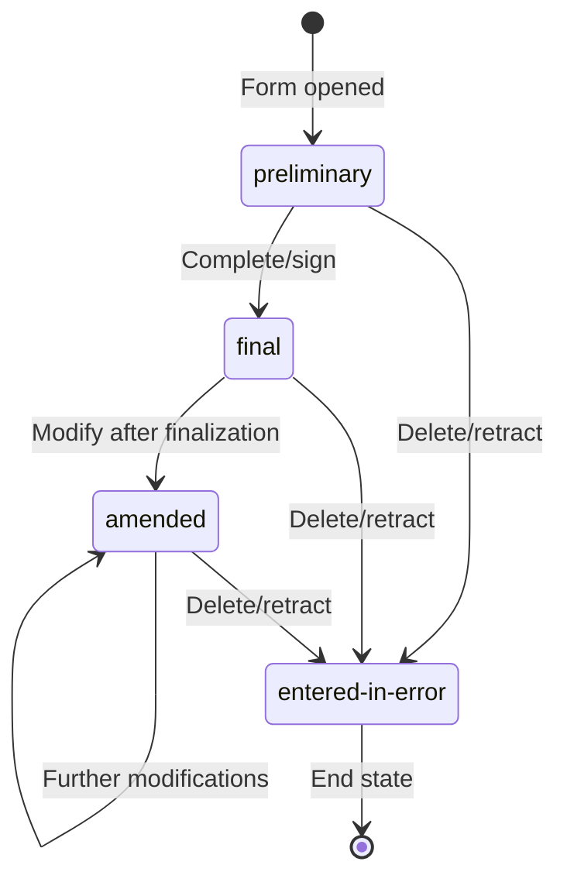

### Clinical document lifecycle

Clinical documents in DHP use the [Composition.status](https://hl7.org/fhir/R5/composition-definitions.html#Composition.status) element to track their lifecycle state. This page describes the status codes used and their transitions.

### Status codes

DHP uses the following R5 Composition status codes:

| Status | Description |
|--------|-------------|
| `preliminary` | Document is being worked on. Data entry is in progress. |
| `final` | Document is complete and verified. No further changes expected. Systems filtering for completed documents should include both `final` and `amended` statuses, see below. |
| `amended` | Document has been modified after being finalized. |
| `entered-in-error` | Document was created in error and should be disregarded. |
| `unknown` | Document status cannot be determined (e.g., imported from external systems). |

### Status transitions

### Usage guidelines

#### preliminary

When a form is first opened and data entry begins, 3rd party systems should synchronize with DHP using status `preliminary`. This signals to other DHP users that work on this document is in progress.

#### final

When a form is completed (or signed and completed), 3rd party systems should set the status to `final`. This indicates the document is verified and authoritative.

#### amended

If a finalized document requires corrections, 3rd party systems should update the data and set status to `amended`. Systems filtering for completed documents should include both `final` and `amended` statuses.

#### entered-in-error

3rd party systems should use this status to delete or retract a document. The document remains in the system for audit purposes but should be excluded from clinical views.

#### unknown

3rd party systems should use this status when importing documents from external sources where the original status cannot be determined. This acknowledges uncertainty rather than incorrectly assuming a document is `final`.
