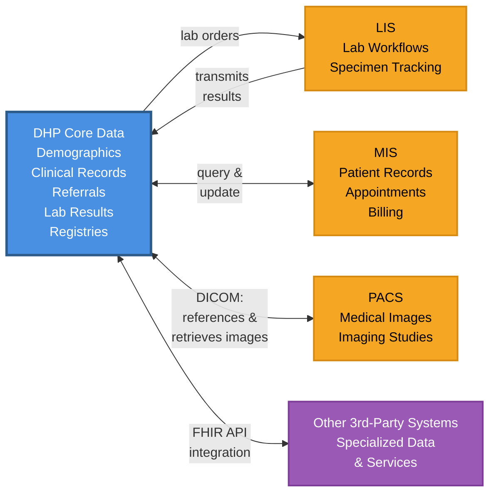
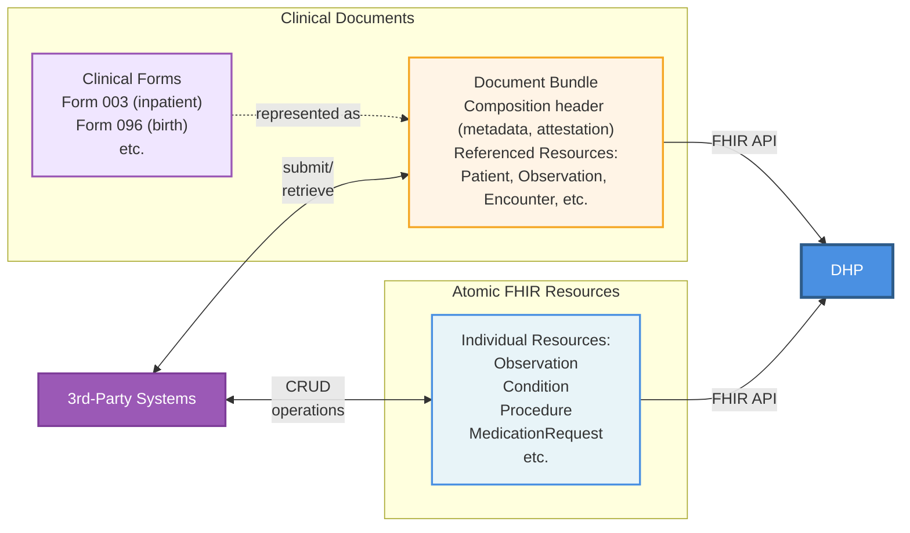

# DHP Integrations Implementation Guide

## Overview

This Implementation Guide defines FHIR R5-based integration specifications for third-party systems that integrate with the [Digital Health Platform (DHP)](https://dhp.uz/fhir/core/en/index.html). It is designed to enable external healthcare systems to exchange data with DHP while maintaining their own data sovereignty.

## Purpose

DHP Integrations IG provides:

- **Standard data structures** - FHIR profiles and extensions for external systems integrating with DHP
- **Terminology** - CodeSystems and ValueSets for standardized coding
- **API specifications** - data exchange patterns between external systems and DHP
- **Integration patterns** - support for DHP's hybrid architecture
- **Conformance requirements** - requirements for third-party system integrations

This IG is intended for implementers developing or configuring systems that need to integrate with DHP. Example systems include Medical Information Systems (MIS), Picture Archiving and Communication Systems (PACS), Laboratory Information Systems (LIS), as well as any other third-party healthcare applications that need to exchange data with DHP.

While external systems may develop their own FHIR Implementation Guides, this IG may include profiles developed collaboratively with external system vendors to streamline the integration process and reduce implementation overhead.

## Integration approach - hybrid model

DHP uses a hybrid integration approach where not all data is centralized. Instead, the platform combines centralized storage of core healthcare data with distributed, specialized data maintained by external systems.

### Data stored in DHP

DHP centrally stores and manages core healthcare data:

- **Patient demographics and master data** - master patient index and demographic information
- **Core clinical records (EHRs)** - essential electronic health record data
- **Referrals and prescriptions** - clinical orders and referral documentation
- **Laboratory results** - lab results and diagnostic reports transmitted from LIS systems
- **Master registries** - patient registry, provider directory, organization registry, and terminology services

### Data maintained by external systems

External systems maintain their own operational data while integrating via FHIR APIs. Examples include:

- **MIS systems** - patient records, appointments, billing data, and facility-specific workflows
- **PACS systems** - medical images and diagnostic imaging studies (DHP supports DICOM-based image exchange, storing references to images in PACS and retrieving images for authorized users)
- **LIS systems** - laboratory workflows, specimen tracking, and detailed test processing data
- **Other 3rd-party systems** - any healthcare application with specialized data or services that need to integrate with DHP

### Integration pattern

For most external system data, DHP can store references to data in external systems rather than duplicating everything. However, certain critical data like laboratory results are transmitted to and stored in DHP. This hybrid approach:

- Maintains data ownership with the originating system
- Enables real-time access to source data through API integration
- Preserves system-specific workflows and business logic
- Simplifies compliance with data governance requirements

DHP and external systems maintain complementary data sets and interact through FHIR and custom APIs: DHP provides authoritative master data and core clinical records, while external systems provide specialized operational data and domain-specific capabilities.

## Data exchange approaches

Integrations with DHP support two complementary methods for exchanging healthcare data:

### Atomic FHIR resources

External systems can interact with individual FHIR resources directly using standard FHIR RESTful operations. This approach involves creating, reading, updating, and deleting discrete FHIR resources such as:

- **Observation** - lab results, vital signs, clinical measurements
- **Condition** - diagnoses, problems, health concerns
- **Procedure** - medical procedures and interventions
- **MedicationRequest** - prescriptions and medication orders
- **Encounter** - patient visits and care episodes

This method is suitable for real-time data exchange where individual clinical facts need to be transmitted independently and processed atomically.

### Clinical forms as Clinical Documents

Healthcare providers often work with standardized clinical forms that capture comprehensive information for specific care scenarios. Examples include:

- **Form 003** - inpatient stay documentation
- **Form 096** - birth registration and documentation
- Other regulatory and clinical forms required by healthcare authorities

In FHIR, such forms can be represented as either Questionnaire resources or Clinical Documents. DHP uses **Clinical Documents** for this purpose. A Clinical Document is structured as a Bundle resource containing:

- **Composition** - document header with metadata, sections, and attestation
- **Referenced resources** - the actual clinical data (Patient, Observation, Condition, etc.)

#### Why Clinical Documents

Clinical Documents provide essential characteristics that make them the preferred approach for healthcare forms:

- **Persistence** - documents remain unaltered for regulatory periods (5, 10, or more years as required by law), surviving beyond their original servers and formats
- **Profile re-use** - Clinical Documents leverage standard FHIR resources, enabling re-use of UZ Core profiles wherever they are a fit, promoting consistency across the healthcare ecosystem
- **Secondary use and interoperability** - Clinical Documents (as FHIR Bundles) can be easily split into individual standard FHIR resources for analytics, reporting, and data exchange, whereas Questionnaire responses have custom data models that vary by questionnaire, making them more challenging to process
- **Stewardship** - healthcare organizations maintain clear responsibility for document care and integrity
- **Authentication** - documents are designed as complete assemblages intended for legal authentication and attestation by healthcare providers
- **Context establishment** - documents provide default context for all contained information, ensuring proper interpretation
- **Human readability** - mandatory narrative requirements ensure that authenticated content is clearly presented and reproducible across different systems, essential for both clinical use and legal validity

In contrast, Questionnaire resources are designed primarily for data capture workflows rather than long-term authenticated storage. Clinical Documents better align with regulatory requirements for healthcare documentation, including mandatory retention periods and the need for legally attestable records.

Note that Clinical Documents and FHIR Questionnaires can be converted between each other when needed using standardized mechanisms: [form population](https://hl7.org/fhir/uv/sdc/populate.html) can convert Clinical Documents to Questionnaires, and [form data extraction](https://hl7.org/fhir/uv/sdc/extraction.html) can convert Questionnaire responses to standard FHIR resources. This interoperability means that if there is a need to develop Questionnaires in the future, that option remains available.

---







