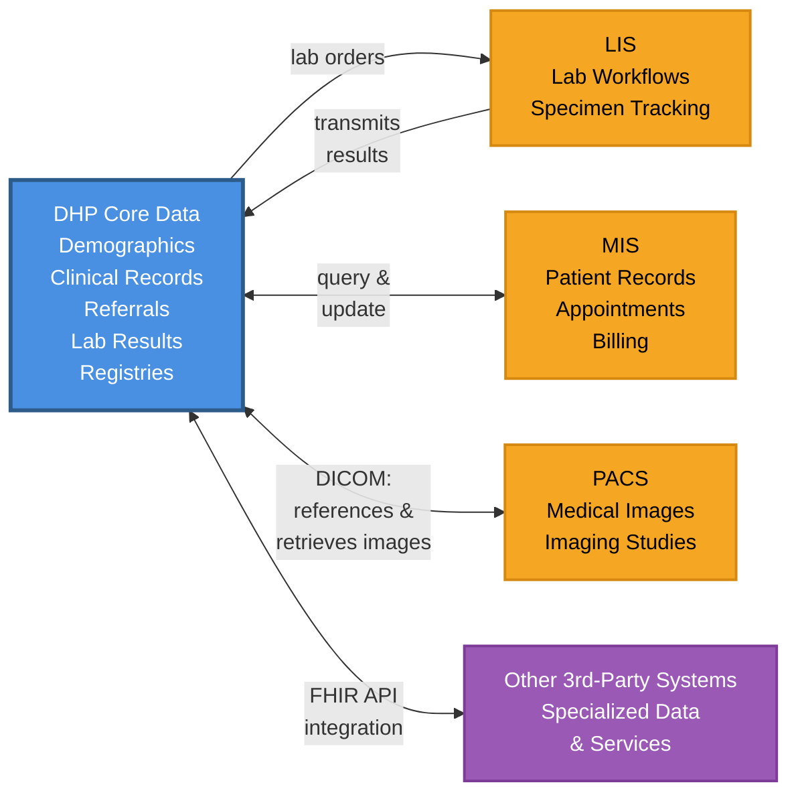
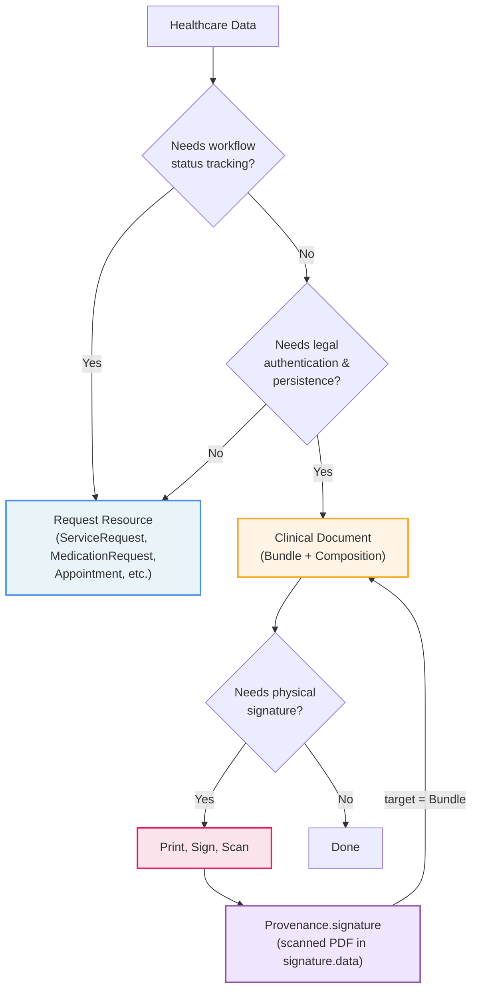

# DHP Integrations Implementation Guide

## Overview

This Implementation Guide defines FHIR R5-based integration specifications for third-party systems that integrate with the [Digital Health Platform (DHP)](https://dhp.uz/fhir/core/en/index.html). It is designed to enable external healthcare systems to exchange data with DHP while maintaining their own data sovereignty.

## Purpose

DHP Integrations IG provides:

- **Standard data structures** - FHIR profiles and extensions for external systems integrating with DHP
- **Terminology** - CodeSystems and ValueSets for standardized coding
- **API specifications** - data exchange patterns between external systems and DHP
- **Integration patterns** - support for DHP's hybrid architecture
- **Conformance requirements** - requirements for third-party system integrations

This IG is intended for implementers developing or configuring systems that need to integrate with DHP. Example systems include Medical Information Systems (MIS), Picture Archiving and Communication Systems (PACS), Laboratory Information Systems (LIS), as well as any other third-party healthcare applications that need to exchange data with DHP.

While external systems may develop their own FHIR Implementation Guides, this IG may include profiles developed collaboratively with external system vendors to streamline the integration process and reduce implementation overhead.

## Integration approach - hybrid model

DHP uses a hybrid integration approach where not all data is centralized. Instead, the platform combines centralized storage of core healthcare data with distributed, specialized data maintained by external systems.

### Data stored in DHP

DHP centrally stores and manages core healthcare data:

- **Patient demographics and master data** - master patient index and demographic information
- **Core clinical records (EHRs)** - essential electronic health record data
- **Referrals and prescriptions** - clinical orders and referral documentation
- **Laboratory results** - lab results and diagnostic reports transmitted from LIS systems
- **Master registries** - patient registry, provider directory, organization registry, and terminology services

### Data maintained by external systems

External systems maintain their own operational data while integrating via FHIR APIs. Examples include:

- **MIS systems** - patient records, appointments, billing data, and facility-specific workflows
- **PACS systems** - medical images and diagnostic imaging studies (DHP supports DICOM-based image exchange, storing references to images in PACS and retrieving images for authorized users)
- **LIS systems** - laboratory workflows, specimen tracking, and detailed test processing data
- **Other 3rd-party systems** - any healthcare application with specialized data or services that need to integrate with DHP

### Integration pattern

For most external system data, DHP can store references to data in external systems rather than duplicating everything. However, certain critical data like laboratory results are transmitted to and stored in DHP. This hybrid approach:

- Maintains data ownership with the originating system
- Enables real-time access to source data through API integration
- Preserves system-specific workflows and business logic
- Simplifies compliance with data governance requirements

DHP and external systems maintain complementary data sets and interact through FHIR and custom APIs: DHP provides authoritative master data and core clinical records, while external systems provide specialized operational data and domain-specific capabilities.

## Data exchange approaches

Integrations with DHP support two complementary methods for exchanging healthcare data:

### Request resources

For operational workflows requiring status tracking, DHP prefers [request resources](https://hl7.org/fhir/R5/workflow.html). Common examples include [ServiceRequest](https://hl7.org/fhir/R5/servicerequest.html), [MedicationRequest](https://hl7.org/fhir/R5/medicationrequest.html), [Appointment](https://hl7.org/fhir/R5/appointment.html), [CarePlan](https://hl7.org/fhir/R5/careplan.html), and [Claim](https://hl7.org/fhir/R5/claim.html). These resources support workflow state tracking (requested → accepted → in-progress → completed), making them ideal for real-time coordination.

### Clinical Documents

For data requiring legal authentication and long-term persistence (e.g., Form 003 for inpatient stays, Form 096 for births), DHP uses **Clinical Documents** - a Bundle containing a Composition header with metadata and attestation, plus referenced clinical resources (Patient, Observation, Condition, etc.).

When a physical signature is required, the document is printed, signed, scanned, and the PDF is embedded in [Provenance.signature.data](https://hl7.org/fhir/R5/provenance-definitions.html#Provenance.signature). DHP pre-adopts the reworked R6 rules from [6.1.2.2.9 Signing Bundles](https://build.fhir.org/signatures.html#Bundles) as they provide a cleaner approach - keeping the signature with the Bundle and making it clear the entire document is signed.

#### Choosing the right approach

---







