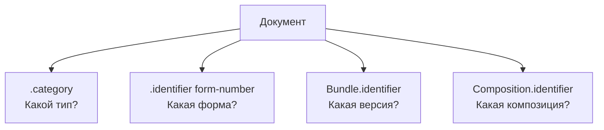

### Категории и идентификаторы документов

DHP использует несколько механизмов для классификации и идентификации клинических документов:
- Коды категорий - основной способ определения типов ресурсов
- Внешние идентификаторы - ссылки на официальные номера форм или шаблонов при их наличии
- Идентификаторы экземпляров - уникальные UUID для различения отдельных экземпляров документов



### Коды категорий

Коды категорий являются основным методом определения типов документов. Используйте `Composition.category` или `CarePlan.category` с кодами из [DocumentCategoryCS](CodeSystem-document-category-cs.html).

```json
{
  "resourceType": "Composition",
  "category": [{
    "coding": [{
      "system": "https://terminology.dhp.uz/fhir/integrations/CodeSystem/document-category-cs",
      "code": "form-094",
      "display": "Справка о нетрудоспособности вследствие опьянения"
    }]
  }]
}
```

Категории основаны на стандартизированных формах Министерства здравоохранения.

### Внешние идентификаторы

Если документ имеет официальный номер формы или шаблона, они записываются в `.identifier`. Не все документы имеют внешние идентификаторы - используйте их при наличии.

#### Номера форм

Официальные номера форм (например Форма 094):

```json
{
  "identifier": [{
    "system": "https://dhp.uz/fhir/core/sid/doc/uz/form-number",
    "value": "094"
  }]
}
```

#### Номера шаблонов

Идентификаторы шаблонов (отличаются от номеров форм):

```json
{
  "identifier": [{
    "system": "https://dhp.uz/fhir/core/sid/doc/uz/template-number",
    "value": "094"
  }]
}
```

### Идентификаторы экземпляров

Отдельные экземпляры различаются с помощью UUID в `.identifier`.

Для [FHIR document Bundles](https://hl7.org/fhir/documents.html) используются два идентификатора:
- `Bundle.identifier` - уникален для каждого экземпляра документа, никогда не используется повторно
- `Composition.identifier` - одинаков для всех документов, созданных на основе одной композиции

При обновлении документа (например, форма создана, а затем изменена) `Composition.identifier` остаётся прежним, тогда как `Bundle.identifier` будет различаться между версиями. Это позволяет системам распознавать, что два пакета документов представляют разные версии одной и той же клинической информации.

```json
{
  "resourceType": "Bundle",
  "identifier": {
    "system": "urn:ietf:rfc:3986",
    "value": "urn:uuid:550e8400-e29b-41d4-a716-446655440000"
  },
  "entry": [{
    "resource": {
      "resourceType": "Composition",
      "identifier": {
        "system": "urn:ietf:rfc:3986",
        "value": "urn:uuid:661f9511-f30c-52e5-b827-557766551111"
      }
    }
  }]
}
```

Для автономных ресурсов (например, CarePlan) используйте собственный `.identifier` ресурса.

### Сводка

| Элемент | Назначение | Пример |
|---------|------------|--------|
| `.category` | Классификация типа документа | «Это справка о нетрудоспособности» |
| `.identifier` (форма/шаблон) | Ссылка на внешний источник | «Это Форма 094» |
| `Bundle.identifier` | Уникальный экземпляр документа | v1: `urn:uuid:aaa...`, v2: `urn:uuid:bbb...` |
| `Composition.identifier` | Идентификатор композиции | v1 и v2: `urn:uuid:ccc...` |

### Пример

См. [Пример CarePlan Формы 095](CarePlan-Form095CarePlanExample.html) для полного примера с категорией, номером формы и идентификатором экземпляра.
