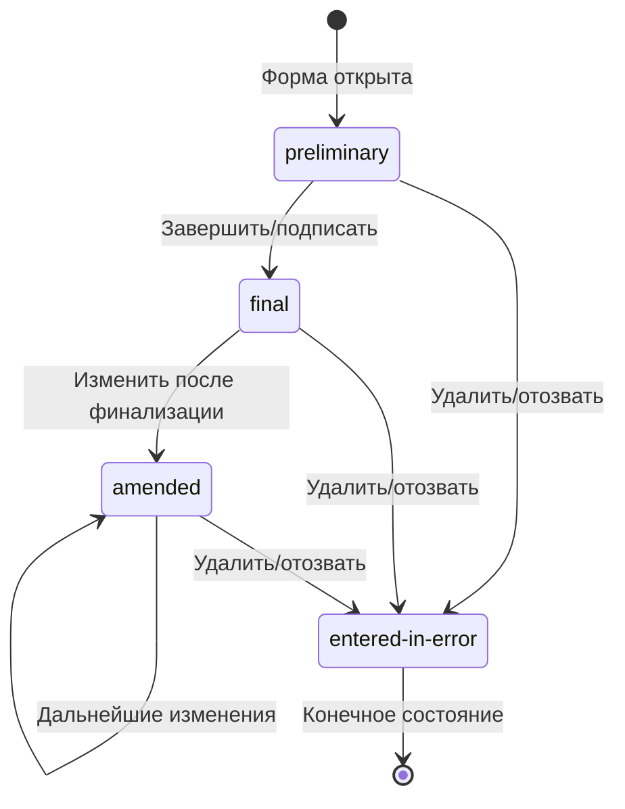

### Жизненный цикл клинических документов

Клинические документы в DHP используют элемент [Composition.status](https://hl7.org/fhir/R5/composition-definitions.html#Composition.status) для отслеживания состояния жизненного цикла. На этой странице описаны используемые коды статусов и их переходы.

### Коды статусов

DHP использует следующие коды статусов Composition из R5:

| Статус | Описание |
|--------|----------|
| `preliminary` | Документ в работе. Ввод данных продолжается. |
| `final` | Документ завершён и проверен. Дальнейшие изменения не ожидаются. Системы, фильтрующие завершённые документы, должны включать оба статуса: `final` и `amended`, см. ниже |
| `amended` | Документ изменён после финализации. |
| `entered-in-error` | Документ создан по ошибке и должен быть проигнорирован. |
| `unknown` | Статус документа не может быть определён (например, импортирован из внешних систем). |

### Переходы статусов

### Рекомендации по использованию

#### preliminary

Когда форма впервые открыта и начинается ввод данных, сторонние системы должны синхронизироваться с DHP, используя статус `preliminary`. Это сигнализирует другим пользователям DHP, что работа над этим документом продолжается.

#### final

Когда форма завершена (или подписана и завершена), сторонние системы должны установить статус `final`. Это указывает, что документ проверен и является авторитетным.

#### amended

Если финализированный документ требует исправлений, сторонние системы должны обновить данные и установить статус `amended`. Системы, фильтрующие завершённые документы, должны включать оба статуса: `final` и `amended`.

#### entered-in-error

Сторонние системы должны использовать этот статус для удаления или отзыва документа. Документ остаётся в системе для целей аудита, но должен быть исключён из клинических представлений.

#### unknown

Сторонние системы должны использовать этот статус при импорте документов из внешних источников, где исходный статус не может быть определён. Это признаёт неопределённость, а не ошибочно предполагает, что документ имеет статус `final`.
