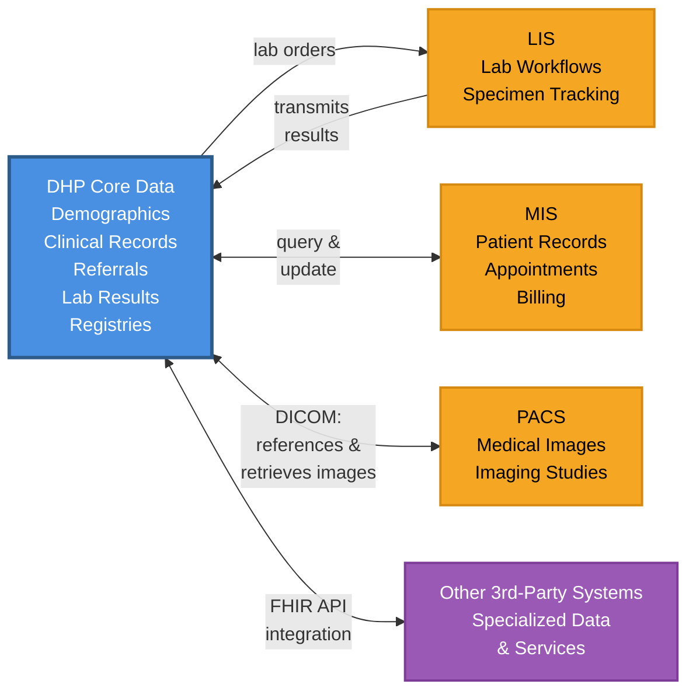
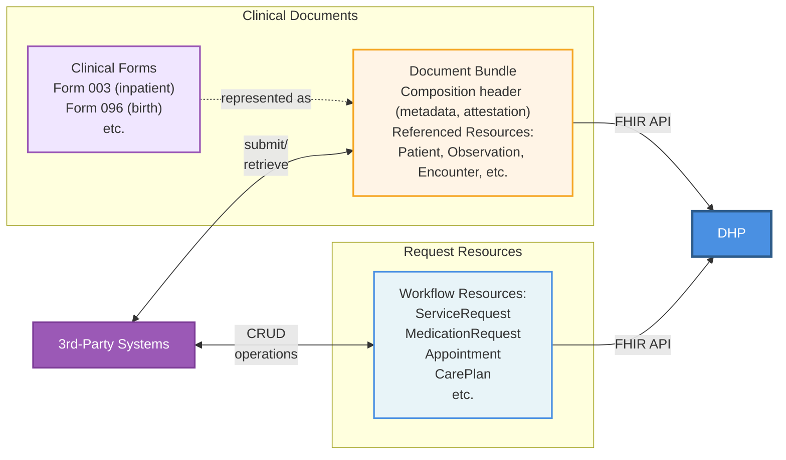
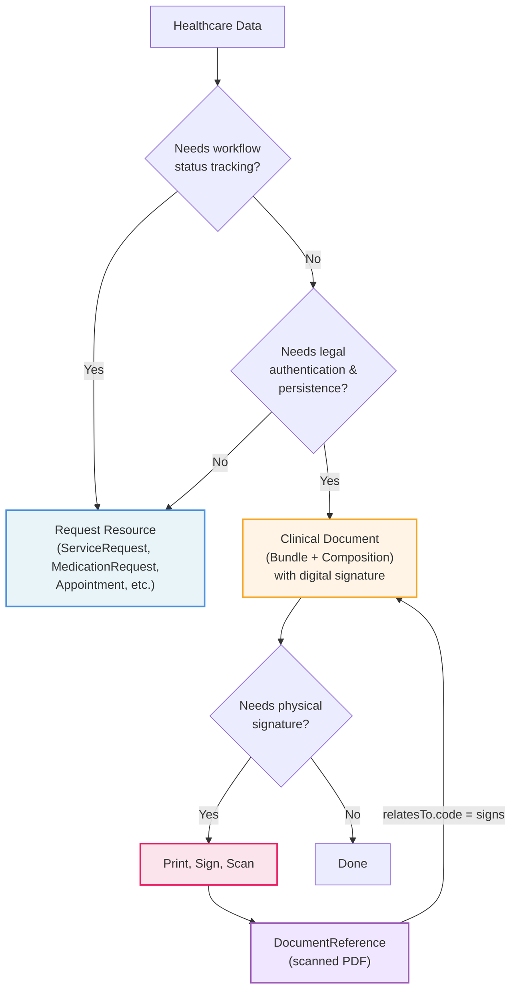

# Руководство по интеграции DHP

## Обзор

Данное руководство по внедрению определяет спецификации интеграции на основе FHIR R5 для сторонних систем, интегрирующихся с [Цифровой платформой здравоохранения (DHP)](https://dhp.uz/fhir/core/ru/index.html). Руководство предназначено для обеспечения обмена данными между внешними системами здравоохранения и DHP при сохранении их собственного суверенитета данных.

## Назначение

Руководство по интеграции DHP предоставляет:

- **Стандартные структуры данных** - FHIR-профили и расширения для внешних систем, интегрирующихся с DHP
- **Терминологию** - CodeSystem и ValueSet для стандартизированного кодирования
- **Спецификации API** - шаблоны обмена данными между внешними системами и DHP
- **Шаблоны интеграции** - поддержка гибридной архитектуры DHP
- **Требования соответствия** - требования для интеграции сторонних систем

Это руководство предназначено для разработчиков, создающих или настраивающих системы, которые необходимо интегрировать с DHP. Примерами таких систем являются медицинские информационные системы (МИС), системы архивирования и передачи изображений (PACS), лабораторные информационные системы (ЛИС), а также любые другие сторонние медицинские приложения, которым необходимо обмениваться данными с DHP.

Хотя внешние системы могут разрабатывать собственные руководства по внедрению FHIR, данное руководство может включать профили, разработанные совместно с поставщиками внешних систем для упрощения процесса интеграции и снижения затрат на внедрение.

## Подход к интеграции - гибридная модель

DHP использует гибридный подход к интеграции, при котором не все данные централизованы. Вместо этого платформа сочетает централизованное хранение основных медицинских данных с распределёнными специализированными данными, поддерживаемыми внешними системами.

### Данные, хранящиеся в DHP

DHP централизованно хранит и управляет основными медицинскими данными:

- **Демографические и мастер-данные пациентов** - мастер-индекс пациентов и демографическая информация
- **Основные клинические записи (ЭМК)** - основные данные электронных медицинских карт
- **Направления и рецепты** - клинические назначения и документация направлений
- **Результаты лабораторных исследований** - результаты анализов и диагностические отчёты, переданные из ЛИС
- **Мастер-реестры** - реестр пациентов, справочник медицинских работников, реестр организаций и терминологические сервисы

### Данные, поддерживаемые внешними системами

Внешние системы поддерживают собственные операционные данные, интегрируясь через FHIR API. Примеры включают:

- **Системы МИС** - записи пациентов, записи на приём, данные биллинга и специфические для учреждения рабочие процессы
- **Системы PACS** - медицинские изображения и диагностические исследования (DHP поддерживает обмен изображениями на основе DICOM, хранение ссылок на изображения в PACS и получение изображений для авторизованных пользователей)
- **Системы ЛИС** - лабораторные рабочие процессы, отслеживание образцов и детальные данные обработки анализов
- **Другие сторонние системы** - любые медицинские приложения со специализированными данными или сервисами, которым необходимо интегрироваться с DHP

### Шаблон интеграции

Для большинства данных внешних систем DHP может хранить ссылки на данные во внешних системах, а не дублировать всё. Однако определённые критические данные, такие как результаты лабораторных исследований, передаются и хранятся в DHP. Этот гибридный подход:

- Сохраняет владение данными за системой-источником
- Обеспечивает доступ к исходным данным в реальном времени через API-интеграцию
- Сохраняет специфические для системы рабочие процессы и бизнес-логику
- Упрощает соответствие требованиям управления данными

DHP и внешние системы поддерживают взаимодополняющие наборы данных и взаимодействуют через FHIR и пользовательские API: DHP предоставляет авторитетные мастер-данные и основные клинические записи, в то время как внешние системы предоставляют специализированные операционные данные и доменно-специфические возможности.

## Подходы к обмену данными

Интеграции с DHP поддерживают два взаимодополняющих метода обмена медицинскими данными:

### Ресурсы запросов

Для операционных рабочих процессов, требующих отслеживания статуса и координации, DHP предпочитает ресурсы запросов. Внешние системы могут взаимодействовать с этими ресурсами напрямую, используя стандартные RESTful-операции FHIR:

- [Appointment](https://hl7.org/fhir/R5/appointment.html) / [AppointmentResponse](https://hl7.org/fhir/R5/appointmentresponse.html) - планирование
- [ServiceRequest](https://hl7.org/fhir/R5/servicerequest.html) - диагностические и процедурные назначения
- [MedicationRequest](https://hl7.org/fhir/R5/medicationrequest.html) - рецепты
- [CarePlan](https://hl7.org/fhir/R5/careplan.html) - координация лечения
- [CommunicationRequest](https://hl7.org/fhir/R5/communicationrequest.html) - коммуникационные рабочие процессы
- [DeviceRequest](https://hl7.org/fhir/R5/devicerequest.html) - заказы на устройства
- [SupplyRequest](https://hl7.org/fhir/R5/supplyrequest.html) - заказы на расходные материалы
- [NutritionOrder](https://hl7.org/fhir/R5/nutritionorder.html) - диетические назначения
- [VisionPrescription](https://hl7.org/fhir/R5/visionprescription.html) - рецепты на оптику
- [Claim](https://hl7.org/fhir/R5/claim.html) - запросы на оплату
- [CoverageEligibilityRequest](https://hl7.org/fhir/R5/coverageeligibilityrequest.html) - проверка страхового покрытия
- [EnrollmentRequest](https://hl7.org/fhir/R5/enrollmentrequest.html) - рабочие процессы регистрации
- [Contract](https://hl7.org/fhir/R5/contract.html) - соглашения
- [ImmunizationRecommendation](https://hl7.org/fhir/R5/immunizationrecommendation.html) - графики вакцинации
- [RequestOrchestration](https://hl7.org/fhir/R5/requestorchestration.html) - сложная координация запросов

Эти ресурсы поддерживают [шаблоны рабочих процессов FHIR](https://hl7.org/fhir/R5/workflow.html) с отслеживанием статуса (например, запрошено → принято → в процессе → завершено), что делает их идеальными для координации между системами в реальном времени.

### Клинические формы как клинические документы

Медицинские работники часто работают со стандартизированными клиническими формами, которые фиксируют комплексную информацию для конкретных сценариев оказания помощи. Примеры включают:

- **Форма 003** - документация стационарного пребывания
- **Форма 096** - регистрация и документация рождения
- Другие регуляторные и клинические формы, требуемые органами здравоохранения

В FHIR такие формы могут быть представлены либо как ресурсы Questionnaire, либо как клинические документы. DHP использует **клинические документы** для этой цели. Клинический документ структурирован как ресурс Bundle, содержащий:

- **Composition** - заголовок документа с метаданными, разделами и аттестацией
- **Связанные ресурсы** - фактические клинические данные (Patient, Observation, Condition и др.)

#### Почему клинические документы

Клинические документы обеспечивают существенные характеристики, которые делают их предпочтительным подходом для медицинских форм:

- **Сохранность** - документы остаются неизменными в течение регуляторных периодов (5, 10 или более лет согласно закону), переживая свои исходные серверы и форматы
- **Повторное использование профилей** - клинические документы используют стандартные ресурсы FHIR, позволяя повторно использовать профили UZ Core там, где они подходят, способствуя согласованности в экосистеме здравоохранения
- **Вторичное использование и интероперабельность** - клинические документы (как FHIR Bundle) могут быть легко разделены на отдельные стандартные ресурсы FHIR для аналитики, отчётности и обмена данными, тогда как ответы на Questionnaire имеют пользовательские модели данных, которые варьируются в зависимости от опросника, что делает их более сложными для обработки
- **Управление** - медицинские организации сохраняют чёткую ответственность за уход за документами и их целостность
- **Аутентификация** - документы разработаны как полные комплекты, предназначенные для юридической аутентификации и аттестации медицинскими работниками
- **Установление контекста** - документы предоставляют контекст по умолчанию для всей содержащейся информации, обеспечивая правильную интерпретацию
- **Человекочитаемость** - обязательные требования к нарративу гарантируют, что аутентифицированный контент чётко представлен и воспроизводим в различных системах, что существенно как для клинического использования, так и для юридической действительности

В отличие от этого, ресурсы Questionnaire предназначены в первую очередь для рабочих процессов сбора данных, а не для долгосрочного аутентифицированного хранения. Клинические документы лучше соответствуют регуляторным требованиям к медицинской документации, включая обязательные сроки хранения и необходимость юридически заверяемых записей.

Обратите внимание, что клинические документы и FHIR Questionnaire могут быть преобразованы друг в друга при необходимости с использованием стандартизированных механизмов: [заполнение форм](https://hl7.org/fhir/uv/sdc/populate.html) может преобразовать клинические документы в Questionnaire, а [извлечение данных форм](https://hl7.org/fhir/uv/sdc/extraction.html) может преобразовать ответы Questionnaire в стандартные ресурсы FHIR. Эта интероперабельность означает, что если в будущем потребуется разработать Questionnaire, эта возможность остаётся доступной.

#### Когда использовать клинические документы вместо ресурсов запросов

Хотя ресурсы запросов предпочтительны для координации рабочих процессов, клинические документы являются лучшим выбором, когда данные необходимо аутентифицировать и сохранить как юридически заверяемые записи. Документы могут быть подписаны цифровой подписью и сохранены как неизменяемые, полные единицы. DHP будет использовать самодостаточные Bundle с заголовками Composition для этой цели.

#### Физические подписи

В случаях, когда документ требует физической подписи (когда цифровой подписи недостаточно), документ будет напечатан, подписан и загружен в DHP в формате PDF с DocumentReference, сопровождающим оригинальный Composition. Это поддерживает связь между цифровым документом и его физически подписанным аналогом, сохраняя юридическую силу физической подписи.

---







