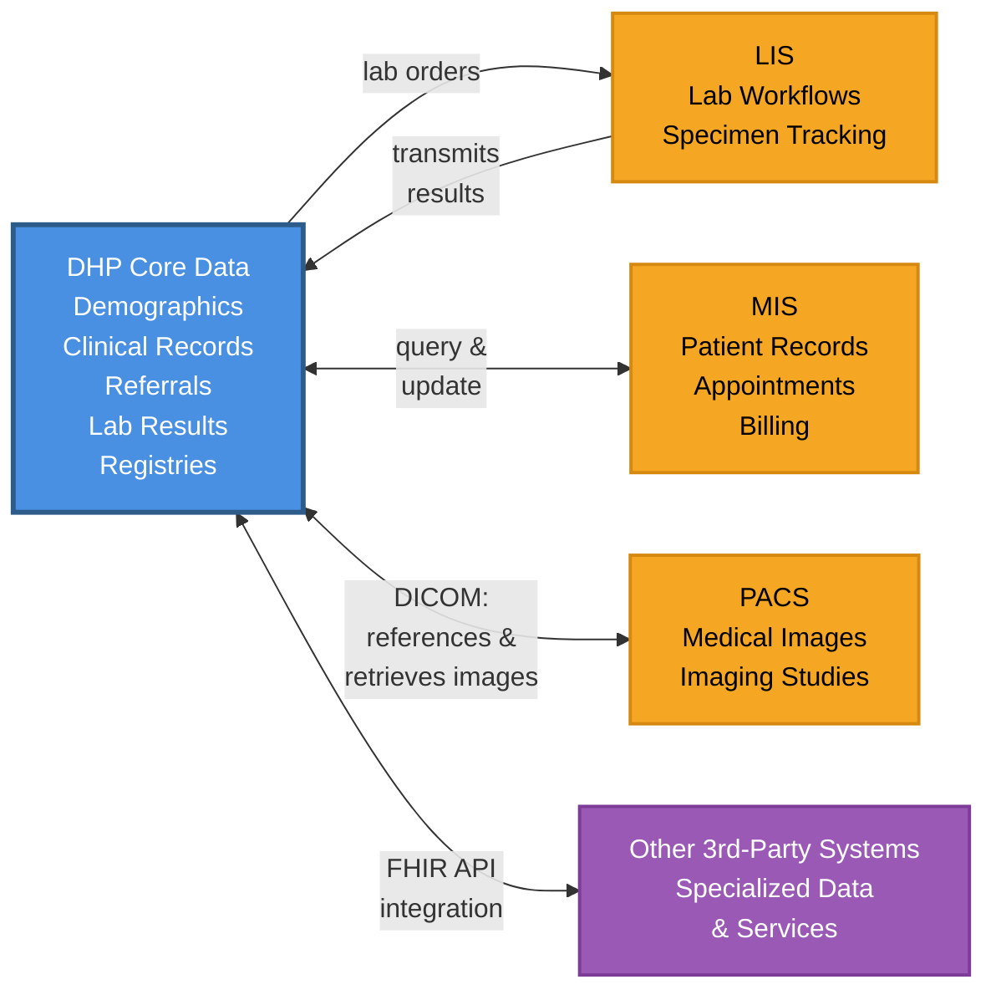
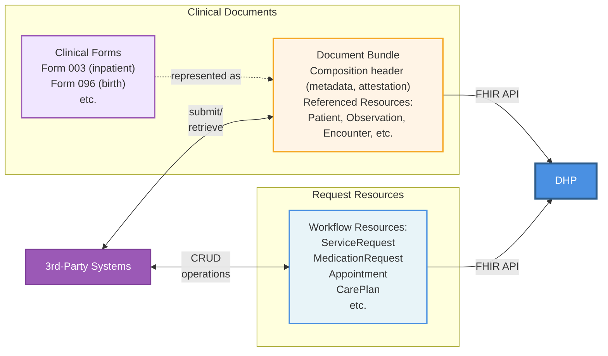
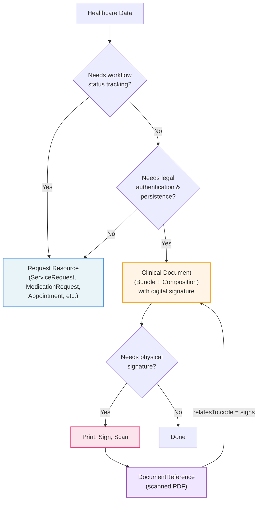

# Руководство по интеграции DHP

## Обзор

Данное руководство по внедрению определяет спецификации интеграции на основе FHIR R5 для сторонних систем, интегрирующихся с [Цифровой платформой здравоохранения (DHP)](https://dhp.uz/fhir/core/ru/index.html). Руководство предназначено для обеспечения обмена данными между внешними системами здравоохранения и DHP при сохранении их собственного суверенитета данных.

## Назначени

Руководство по интеграции DHP предоставляет:

- **Стандартные структуры данных** - FHIR-профили и расширения для внешних систем, интегрирующихся с DHP
- **Терминологию** - CodeSystem и ValueSet для стандартизированного кодирования
- **Спецификации API** - шаблоны обмена данными между внешними системами и DHP
- **Шаблоны интеграции** - поддержка гибридной архитектуры DHP
- **Требования соответствия** - требования для интеграции сторонних систем

Это руководство предназначено для разработчиков, создающих или настраивающих системы, которые необходимо интегрировать с DHP. Примерами таких систем являются медицинские информационные системы (МИС), системы архивирования и передачи изображений (PACS), лабораторные информационные системы (ЛИС), а также любые другие сторонние медицинские приложения, которым необходимо обмениваться данными с DHP.

Хотя внешние системы могут разрабатывать собственные руководства по внедрению FHIR, данное руководство может включать профили, разработанные совместно с поставщиками внешних систем для упрощения процесса интеграции и снижения затрат на внедрение.

## Подход к интеграции - гибридная модель

DHP использует гибридный подход к интеграции, при котором не все данные централизованы. Вместо этого платформа сочетает централизованное хранение основных медицинских данных с распределёнными специализированными данными, поддерживаемыми внешними системами.

### Данные, хранящиеся в DHP

DHP централизованно хранит и управляет основными медицинскими данными:

- **Демографические и мастер-данные пациентов** - мастер-индекс пациентов и демографическая информация
- **Основные клинические записи (ЭМК)** - основные данные электронных медицинских карт
- **Направления и рецепты** - клинические назначения и документация направлений
- **Результаты лабораторных исследований** - результаты анализов и диагностические отчёты, переданные из ЛИС
- **Мастер-реестры** - реестр пациентов, справочник медицинских работников, реестр организаций и терминологические сервисы

### Данные, поддерживаемые внешними системами

Внешние системы поддерживают собственные операционные данные, интегрируясь через FHIR API. Примеры включают:

- **Системы МИС** - записи пациентов, записи на приём, данные биллинга и специфические для учреждения рабочие процессы
- **Системы PACS** - медицинские изображения и диагностические исследования (DHP поддерживает обмен изображениями на основе DICOM, хранение ссылок на изображения в PACS и получение изображений для авторизованных пользователей)
- **Системы ЛИС** - лабораторные рабочие процессы, отслеживание образцов и детальные данные обработки анализов
- **Другие сторонние системы** - любые медицинские приложения со специализированными данными или сервисами, которым необходимо интегрироваться с DHP

### Шаблон интеграции

Для большинства данных внешних систем DHP может хранить ссылки на данные во внешних системах, а не дублировать всё. Однако определённые критические данные, такие как результаты лабораторных исследований, передаются и хранятся в DHP. Этот гибридный подход:

- Сохраняет владение данными за системой-источником
- Обеспечивает доступ к исходным данным в реальном времени через API-интеграцию
- Сохраняет специфические для системы рабочие процессы и бизнес-логику
- Упрощает соответствие требованиям управления данными

DHP и внешние системы поддерживают взаимодополняющие наборы данных и взаимодействуют через FHIR и пользовательские API: DHP предоставляет авторитетные мастер-данные и основные клинические записи, в то время как внешние системы предоставляют специализированные операционные данные и доменно-специфические возможности.

## Подходы к обмену данными

Интеграции с DHP поддерживают два взаимодополняющих метода обмена медицинскими данными:

### Ресурсы запросов

Для операционных рабочих процессов, требующих отслеживания статуса, DHP предпочитает [ресурсы запросов](https://hl7.org/fhir/R5/workflow.html). Примеры включают [ServiceRequest](https://hl7.org/fhir/R5/servicerequest.html), [MedicationRequest](https://hl7.org/fhir/R5/medicationrequest.html), [Appointment](https://hl7.org/fhir/R5/appointment.html), [CarePlan](https://hl7.org/fhir/R5/careplan.html) и [Claim](https://hl7.org/fhir/R5/claim.html). Эти ресурсы поддерживают отслеживание состояния (запрошено → принято → в процессе → завершено), что делает их идеальными для координации в реальном времени.

### Клинические документы

Для данных, требующих юридической аутентификации и долгосрочного хранения (например, Форма 003 для стационара, Форма 096 для рождений), DHP использует **клинические документы** - Bundle, содержащий заголовок Composition с метаданными и аттестацией, а также связанные клинические ресурсы (Patient, Observation, Condition и др.).

Когда требуется физическая подпись, документ печатается, подписывается, сканируется и загружается как PDF. DocumentReference связывает отсканированную копию с оригинальным Composition.

#### Выбор подхода

---







